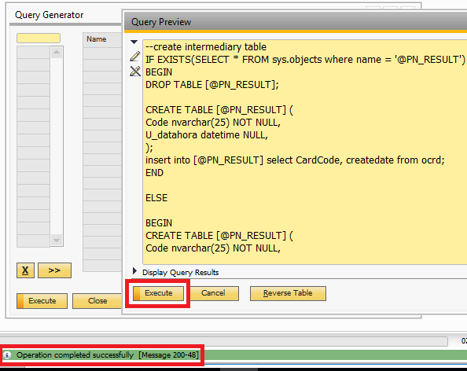
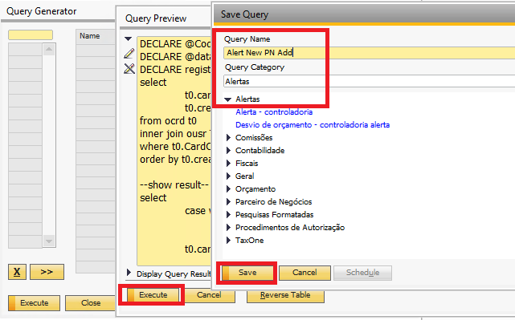
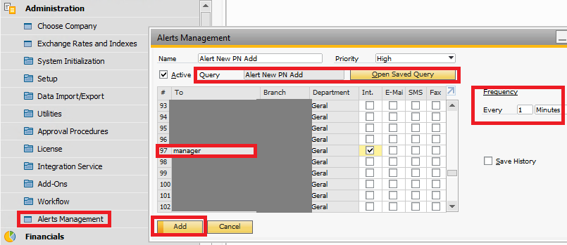
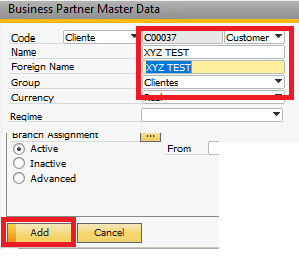
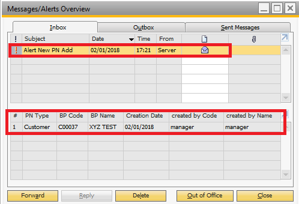

# SAP-B1-Alert-with-unique-results-SQL-SERVER

Alert that always returns unique records, being triggered whenever there are new results

Alert: Go in link to see a new version that meets SAP version 10 and does not use cursors [Link](https://github.com/MRGhidini/SAP-B1-Alert-with-unique-results-SQL-SERVER-New)

# Symptom

Imagine that the client does not want to receive the same result every time the alert is triggered, and wants only new records every time they are added. (As an example I will use the PN registry)

# Requirements

* SQL Server
* SAP Business One
* Job Service Alert - activated in the database

# Usage

1 - First, open the "Query Manager" , execute the query "1 - Intermediatio PN Table.sql" so that the table is created and fed with all existing records.

2 - Second, open the "Query Manager", paste the query "2 - New PN result Alert.sql" and save

3 - Third, create an alert in "Alert Management" with a frequency of 1 in 1 minute and point the query save in step 2

# Final result

Whenever a new record is added, the alert will be activated showing only once, only the new records

* Adding a new PN

* Receiving alert

